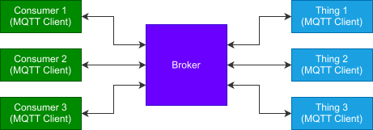
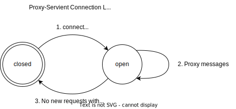
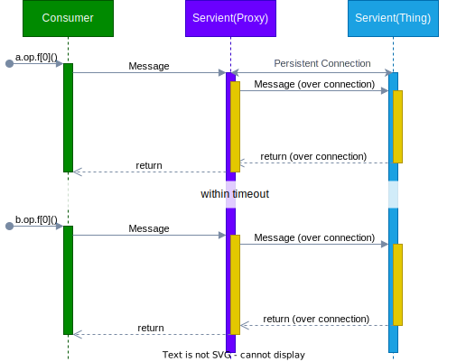

# TD.Next Usability and Design Work Items

Changes that improve readability, the usability of the specification OR development, spec generation, bug fixes, and testing of the specification do not need use cases.
These have more priority since they can impact how new features look like in a TD instance.

## Design Document

We should start a TD (re)design document that explains the idea behind the design of different features. See [issue 1889](https://github.com/w3c/wot-thing-description/issues/1889).

## Document reorganization

Changes that should be done while keeping the current content

### Common Definition Section

Usability and readability improvements for not needing to "jump around" while reading

### Grouping of Normative Requirements

Making sure that important normative text is not scattered around too much.

### Assertion id Alignment

Adding `td`, checking naming scheme

### Better Integration of Thing Model

There were questions about how much a TM is related to the TD.
Some discussion might be needed.

## Synchronization with Other Documents

### Discovery Sync

Moving discovery-related text from TD to Discovery

### Architecture Sync

Checking overlaps with architecture.

## Reusable TD Elements

### Reusable Connections

**User Stories:**

1. Connection Oriented Protocols

- Who: As a deployer of devices with connection oriented protocols
- What: Reusable Connection descriptions in a TD
- Why: better describe connection oriented protocols such as MQTT and WebSockets (Problem nb. 4 below)

2. Reusable Defaults per TD

- Who: Designer/Developer of TDs
- What: Reusable Connection descriptions in a TD
- Why: simplify TDs in cases without usage of default terms or to avoid redundancy (Problem nb. 1, 2 and 3 below)

TODOs:

- These can be turned into single sentences to "force" submitters to be concise.
- The use case should be linked to the user stories above.

**Problem:**
Currently, each form of an affordance has information on the endpoint, media type and other protocol related information.
It is possible to use the base term for simplifying the endpoint but it has limitations such as:

1. If the media type is common across forms but is not `application/json`, it is repeated in each form.
2. If there are common protocol stack configurations such as different default verbs, baud rates, and endianness, they are repeated in each form
3. Multiple bases are not possible. Thus, each form repeats multiple bases. This is relevant when a TD has local and public IP addresses
4. For protocols that are based on an initial connection and then subsequent messages, the semantics are not clear. Thus, a Consumer can establish multiple connections instead of reusing the initial connection. See the Example of the Message Flow section below

Related Issues:

- Umbrella Issue: <https://github.com/w3c/wot-thing-description/issues/1248>
- Media Type and Security Override: <https://github.com/w3c/wot-thing-description/issues/204>: Sharing a media type and security (already possible) among forms
- Single base with multiple protocols: <https://github.com/w3c/wot-thing-description/issues/803>: Having the same feature as the `security` term in form protocols
- Reused Connection: <https://github.com/w3c/wot-thing-description/issues/878>: Implying a first connection that is not dropped but actually reused later
- Out-of-band IP address: <https://github.com/w3c/wot-thing-description/issues/977>: Sort of related. Deducing the IP address from an out-of-band way
- Reused Connection in WS: <https://github.com/w3c/wot-thing-description/issues/1070>: Similar issue to 878 but giving more details on WebSocket
- Linking to Initial Connection: <https://github.com/w3c/wot-thing-description/issues/1242>: Similar issue to 803.
- Reused Connection in WS 2: <https://github.com/w3c/wot-thing-description/issues/1664>: Similar issue to 878 abd 1070
- Linking to Initial Connection 2: <https://github.com/w3c/wot-thing-description/issues/1834>: Similar issue to 803 and 1242

**Requirements**

- Basic Requirement: A mechanism to describe connection and protocol information that other forms can use is needed. In protocols with initial connection, this can also be used to indicate what needs to be done by the Consumer before executing any operation.
- Detailed Requirements:
  - Each connection needs to be identifiable, but we need to make sure not to include privacy or security risks
  - The initial connection must not be mandatory to establish upon TD consumption and should left to the implementation when to establish and close it.

**Notes:**

- When to close the connection needs to be discussed.
- Complex security mechanisms exchange should be handled at the same time

#### Examples of Message Sequences

##### Simple HTTP Connection

###### Participating Entities

In this case, the Thing has enough resources and contains its own HTTP server.

###### Lifecycle of a Connection

1. A request from the client opens the connection to the server.
2. A response from the server back to the client closes the connection.
3. If the server provides no response in a given time interval, a timeout occurs and the connection is closed.
4. Alternatively, a request can be sent with Keep Alive parameters (timeout and max requests parameters).
5. In this case, the responses back to the client will not close the connection.
6. If a certain amount of requests have been sent, the connection will be closed.
7. If a certain time is reached, the connection will be closed.

###### Message Sequence

We note that even with Keep Alive option set, the interaction pattern do not change in the application level.
Thus, keep alive can be seen as an optimization and not a different way to interact.

##### Broker Connections without Security

###### Participating Entities

Typically, the broker is a separate entity than the Thing.

###### Lifecycle of a Connection

1. A client connects to the broker and opens a consistent connection.
2. Client can subscribe or publish to topics as long as the connection is active.
3. Client can disconnect from the broker and close the connection.
4. If the device turns off or has an error, the connection can be closed.

###### Lifecycle of a Subscription

1. A Client already connected to the broker (open connection), can subscribe to a topic where that subscription becomes active.
2. Multiple messages can be received while the subscription is active.
3. Once the client unsubscribes from the topic, the subscription becomes inactive.

###### Message Sequence

We note that, even after a time has passed, the connection stays open and the subscription stays active.
The client id is used in a connection but is typically not exposed to the application layer.

##### Basic WebSocket Connections

###### Participating Entities

In this case, the Thing has enough resources and contains its own WebSocket server.

###### Lifecycle of a Connection

The lifecycle of a WebSocket connection in the Web of Things typically includes the following stages:

1. **Connection Establishment**: The client initiates a handshake request to the server, which responds with a handshake response, establishing a persistent connection.
2. **Data Transmission**: Once connected, the client and server can exchange data bi-directionally in real-time, with messages sent as frames. This may include ping/pong frames to keep understand connection "liveness" between the parties.
3. **Connection Closure**: Either party can initiate the closing handshake by sending a close frame, after which the connection is terminated, and resources are released.

###### Message Sequence

##### OAuth2-based Interaction

###### Participating Entities

In this case, the Thing has enough resources and contains its own HTTP server.

###### Lifecycle of a Session

The lifecycle of an OAuth token in a session involves the following stages:

1. **Token Request and authorization**: The client requests an access token from the authorization server, typically after authenticating and obtaining user consent.
2. **Token Use**: The client uses the access token to access protected resources on the resource server by including it in API requests.
3. **Logout**: The client or authorization server can revoke tokens to terminate the session, preventing further access.
4. **Token Expiry and Refresh**: Access tokens are time-limited. If a refresh token is available, the client can request a new access token without user reauthorization.

###### Message Sequence

##### Proxy-based Communication

###### Participating Entities

In this case, the Thing has enough resources and contains its own HTTP server.

###### Lifecycle of a Connection

###### Message Sequence

### Data Schema Mapping

Also known as: Mapping TD elements to messages

- Some protocols have a main channel and auxiliary/ancillary/side channels to exchange information, e.g HTTP has Headers, URI-Variables, Payload/Body.
- Some protocols may have a default/unique `contentType` for at least one of the channels, others are fixed or flexible. e.g. HTTP Headers are key-value strings, Modbus uses only boolean and 16bit quantities.
- Some protocols do not have the concept of `contentType` at all.
- Some `contentType` may be more expressive than our DataSchema, e.g. CBOR [Maps with integer keys](https://www.rfc-editor.org/rfc/rfc8949.html#map-keys).

#### Open questions

- How can we describe how the logical information (state for property, input/output messages for actions, messages for event) is mapped to each channel?
- Do we need to reconsider how we express `contentType` and `contentCoding` in the case more than a channel allows flexible data formats?
- Do we want to provide a way to express a serialization scheme for protocols that have only inflexible (e.g. binary-only) channels, without going through the route of declaring a `contentType`?
- Do we want to provide a way to express a serialization scheme between our DataSchema and richer contentTypes (e.g XML, CBOR)?

#### Related Issues:

- [BACnet URI Variables discussion](https://github.com/w3c/wot-binding-templates/issues/302)
- [Complex data types in simple protocols](https://github.com/w3c/wot-thing-description/issues/1936)
- [jsonrpc-over-websocket](https://github.com/w3c/wot-binding-templates/issues/125)
- [xml binding discussion](https://github.com/w3c/wot-binding-templates/issues/139)
- [cbor analysis](https://github.com/w3c/wot-binding-templates/issues/8)
- [initial issue with this](https://github.com/w3c/wot-binding-templates/issues/219)
- [aka payload pattern](https://github.com/w3c/wot-thing-description/issues/1217)
- [HTTP Headers in directory exploration (Problem 2)](https://github.com/eclipse-thingweb/node-wot/issues/1221)

### Security Schemes Refactoring

 

The need to be refactored and use the same pattern as other reusable elements

Relevant discussions:

- https://github.com/w3c/wot-thing-description/issues/1394

### Inline Security

 

Simplifying the way to describe security when there is only one mechanism needed to be described (in contrast to needing two terms at the moment)

Relevant discussions:

- https://github.com/w3c/wot-thing-description/pull/945

### Reusable Element Design

Scenarios, requirements, and use the same pattern for all reusable elements.
This will influence the items above.

Related discussions:

- https://github.com/w3c/wot-thing-description/pull/1341 (but many are linked here as well)

## Affordance Uniformity

Uniform pattern/state machines between Actions, Events, and Properties.

- Avoid doing the same thing in a different way, for example how to express observability and cancellation
- Relationships across affordances, for example when an Action changes the state of a Property
- Property vs. Action (also URI Variables redesign question)

## Normative Parsing, Validation, Consumption

Currently, the TD specification defines an abstract information model and a default JSON serialization for TDs.
However, parsing, consuming and validating TDs are not normatively defined.
A validation process is defined but is not normative, which leads to certain ambiguities for a Consumer parsing a TD.
Additionally, no method is proposed for validation of the extensions that are used via the prefixes and the @context.
The WG will specify normative algorithms for parsing, consuming and validating TDs to ensure interoperability of Consumers.

### TD Validation

What is a valid TD, are there any levels of validness?

- A TD validator can do only JSON Schema validation but that is not enough to test everything.
- A TD may be not completely valid but usable by a "degraded consumer" (see below) or a TD can be completely valid according to all the assertions and protocol bindings but not be usable by some consumers.

Additionally, we need better validation of protocols and associated security in the TD.

### Consumption Rules

Do we want to prescribe how TDs are processed and consumed beyond the text level?

### Degraded Consumption

- Rule for uniform degradation across consumers, e.g. TD too big, protocol or protocol options unknown, contentType unknown, etc.
