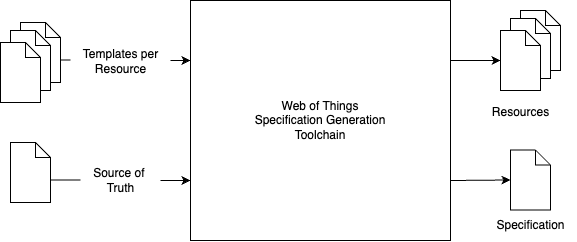
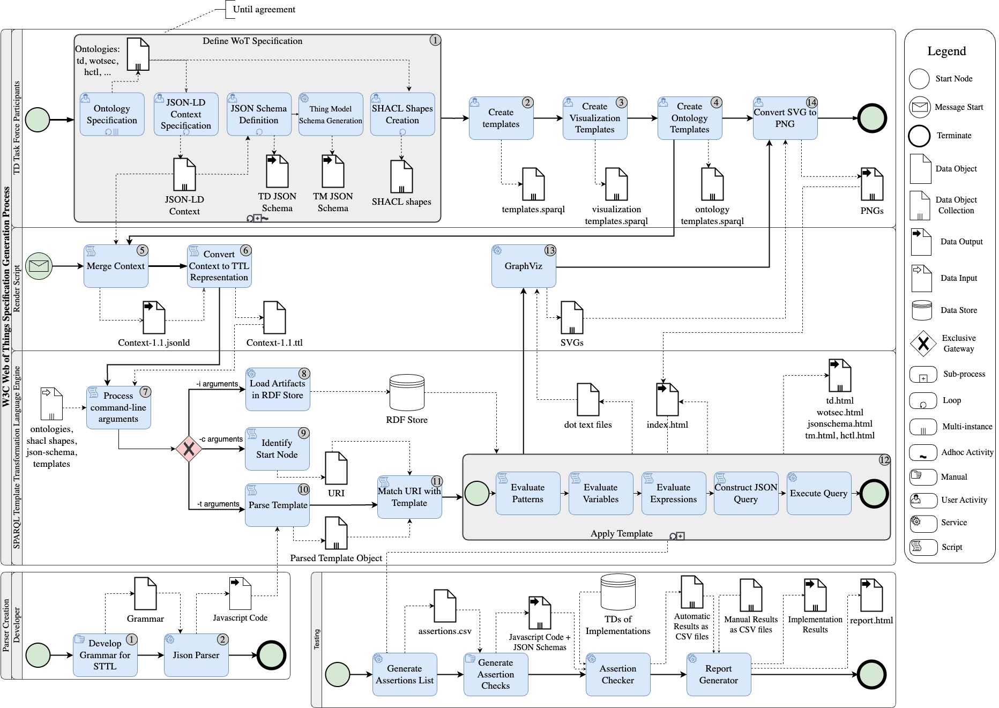

# W3C Web of Things Specification Generation Process

## High-level Approach

Looking at a higher level, the specification generation process is about changing a small number of files and generating different resources such as the specification text, vocabularies, and schemas as detailed in our requirements document's [output resources section](https://github.com/w3c/wot-thing-description/blob/main/toolchain/requirements.md#output-resources).
The diagram below provides this high-level vision where we can see the inputs and outputs.
The template style inputs are written mostly once in the beginning and are generally specific to each resource, whereas the source of truth is what the TD Task Force works on at each Pull Request to generate the specification text and resource.

## Detailed Current Process

The current W3C WoT specification generation process toolchain is depicted as a Business Process Modeling Notation (BPMN) diagram in the figure below. This is a result of years of work that have resulted in different tools that require high manual effort to keep everything synced. The future goal is to switch to an easier-to-maintain toolchain that is usable by people without a deep understanding of the technologies involved.

There are 4 actors involved:

1. **_Semantic Web Expert_**
2. **_WoT Toolchain_**
3. **_SPARQL Template Transformation Language Engine_**
4. **_Parser Creation_**

The Semantic Web Expert has the main responsibility to iteratively define the schema of different TD model specifications such as TD core, TM, WoTsec, HCTL or any extensions required. Also, the JSON Schema definition is defined for syntactical validation of JSON-LD data and Shapes Constraint Language (SHACL) shapes for validating RDF graphs. These different tasks are performed in an adhoc manner until agreement is achieved among the experts. In addition, the experts define a set of transformations for the specification generation according to the SPARQL Template Transformation Language (STTL). The templates expressed in STTL describe different rules for transforming a source RDF graph into a result text.

The WoT Toolchain is a shell script (render.sh), which manages the interaction between different Node.js scripts developed to achieve different objectives. It receives the different JSON-LD context files for each vocabulary in the TD model and aggregates them into one. The resulting JSON-LD context is then converted into RDF Turtle representation format. The artifacts provided by the Semantic Web Experts and the RDF graphs are provided as input to the STTL Engine.

The STTL engine takes different RDF graphs: TD model ontologies, SHACL shapes (validation/td-validation.ttl), merged context (context/td-context.ttl), a transformation (a set of templates), and a specific starting node that determines the starting HTML node pointing to the WoT Things Descriptions as a set of command-line arguments. The TD model ontologies and SHACL shapes are loaded and stored in an RDF store for semantic processing and querying. Then, the STTL templates are parsed according to the parser developed by the Parser Creation actor. This is followed by matching the input HTML node with one of the transformation names specified in the template. A template in a transformation may apply other templates or include different utility functions or SPARQL functions. Therefore, the Apply Template sub-process identifies these different cases and applies the rules which includes the following activities: evaluate patterns, variables and expressions in a template, construct the query to execute using a JSON format, and executing the query on the RDF graph. The output is generated HTML textual output format corresponding to the index.html file of the TD specification and the different ontology specifications.

The TD specification include diagrams that are also generated from the same SHACL and merged context sources. The STTL Engine is run once more to generated diagrams in textual form (DOT text files) and then turned into graphics using Graphviz tool. The output is the SVG figures of the TD specification, which is then manually converted into PNG using a desired tool of choice. These PNG files are used to feed the HTML specification.

The Parser Creation process is mainly performed by a developer using a 2-step process. The grammar is developed manually using to context-free grammar according to the semantics of STTL language. Then, Jison tool takes the grammar as input and outputs a JavaScript file capable of parsing the language described by that grammar. The generated script is then used to parse visualization template inputs in the STTL Engine.

## Requirements for Toolchain

Before working on the restructuring of the toolchain to make it simpler, we can write the requirements of the toolchain 
by listing what kind of inputs we want to work on and what kind of outputs we want to provide to the users (reader, implementer, spec writers).

**Overall Goal:** Change a small number of files (source of truth) but generate as many resources as needed by users.

**Compromise:** Reduce the amount of cross-checking between files by a human expert. In this case, everything is not automatically generated.

## General Requirements for Toolchain

1. Someone without expertise in our tooling should be able to make contributions. This is especially relevant for binding contributions from experts of the protocol who are not experts of the semantic web or the type of tooling we have. Thus, the learning curve should not be steep at all.
    1. Relying on well-known tools would make it easier. Templating engines like [Handlebars](https://handlebarsjs.com/) are well-known. STTL is not well-known and doesn't support all the features we need.
    2. More documentation about the entire repository configuration and tooling (Actions, hooks, npm scripts to run at some point etc.)
2. It should be easy to debug/observe the process.
3. If multiple tools are "chained together", we should ensure that the inputs and outputs match. An example would be if the generated JSON Schema is badly structured, it would result in cryptic TS definitions.
4. Not mixing up multiple languages in one resource file (currently, we have HTML snippets in SHACL shapes).
5. (Optional) The tooling should be easy to install and understand the inner workings.

## Output Resources

Output resources are given to the users of the specification for various usages.

The following resources are updated each time the "source of truth" in the input resources is updated:

- Editor's Draft index.html -> Should be provided with each PR. Used for PR Preview.
  - Users: Read by spec writes and early adopters of features.
- UML Class Diagrams -> Integrated into index.html
- Ontologies: HTML and TTL format
- JSON-LD Context
- JSON Schemas: For TD and TM
- SHACL Shapes
- Abstraction or Interfaces for Programming Languages: 
  - TypeScript definitions: Currently done via Scripting API TF
  - We need to clarify it for other languages
- Test cases: Each feature has its test case(s). Currently in Eclipse Thingweb but will be moved here

The following resources are updated less frequently, generally in publication phases:

- Publication index.html (Overview.html) -> Done with each publication
  - Users: Adopters of the standard
- UML Class Diagrams: Beautified versions of the "always synced" diagrams
  - Users: Adopters of the standard (to give an overview)

## Input Resources

Input resources, referred to as source of truth, are what the TD Task Force writes and maintains to generate the output resources for the users.

The following resources are updated for each change:

- Single source of truth in the form of one file (can be split into multiple for maintainability)

The following resources are written mostly at the beginning of work:

- Any template file

To clarify:

- File type and structure of each resource.
